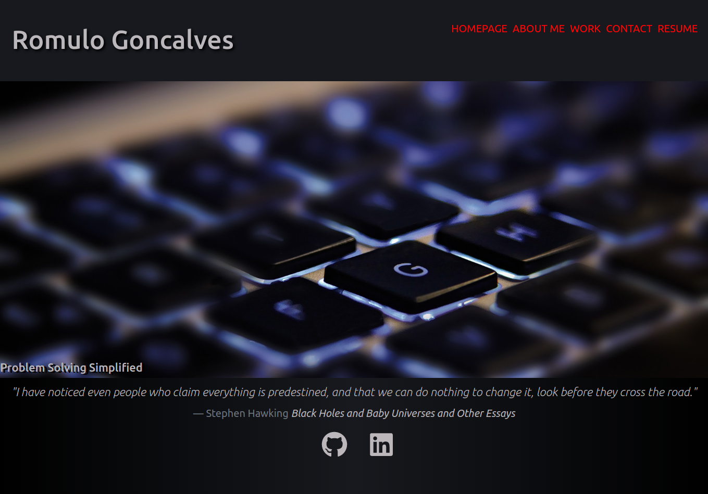

# Portfolio on React
[Link to Deployed Application](https://krooksoma.github.io/RepoOnReact/)    
    

## Table of Contents
    
* [Description](#description)
* [Installation](#installation-instructions)
* [Usage Info](#usage-info)
* [Contribution](#contribution)
* [Testing Instructions](#test-instructions)
* [License](#license)
* [Questions](#questions)
* [Tools and Technologies](#tools-and-technologies)

    

## Description
    My new portfolio developed with React.js to display my latest completed projects.
    
## Tools and technologies

* REACT
* HTML
* CSS
* JavaScript

## Installation Instructions
    No installation necessary.

## Usage info
    Navigate to the tabs and see all the information you want. On the works tab you can 
    also access the deployed pages and github for each of my projects..

## Contribution
    contribution upon requests.

## Test Instructions
    undefined.    

## License
    This project is covered under MIT license.

## Questions
    For questions please refer to 
[Linkedin](https://www.linkedin.com/in/romulo-goncalves-45602539/)  
    or
    romulojusto@gmail.com
    
